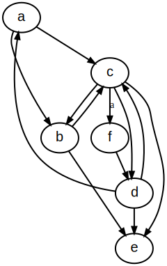
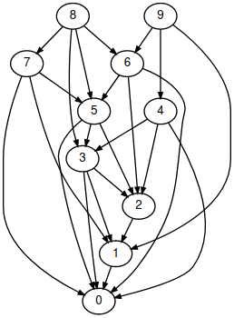
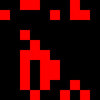
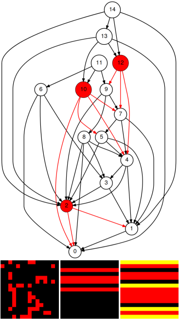
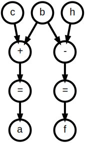
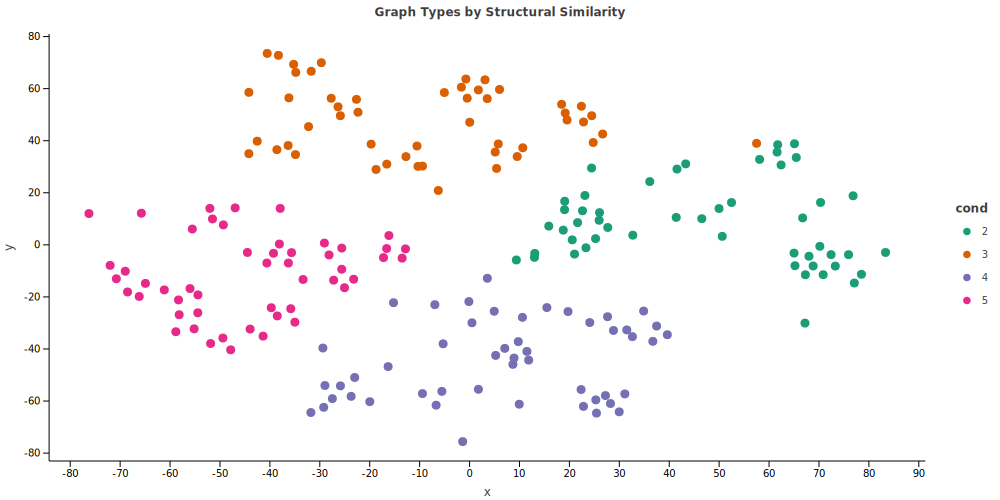
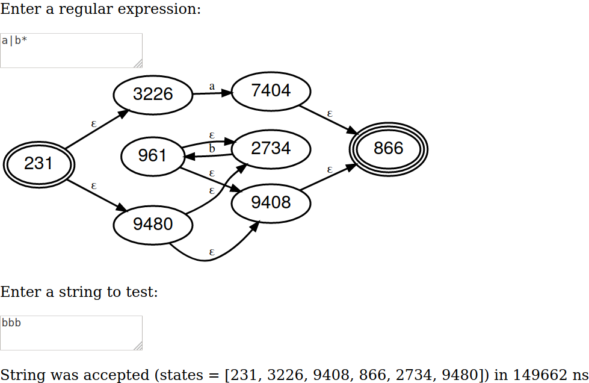

# Kaliningraph

[](http://kotlinlang.org)
[](https://jitpack.io/#breandan/kaliningraph)
[](https://github.com/breandan/kaliningraph/actions)

Kaliningraph is a purely functional graph library with a DSL for constructing graphs and visualizing the behavior of graph algorithms.


## Installation

Kaliningraph is hosted on [JitPack](https://jitpack.io/#breandan/kaliningraph/).

### Gradle

```kotlin
repositories {
    maven("https://jitpack.io")
}

dependencies {
    implementation("com.github.breandan:kaliningraph:0.1.4")
}
```

### Maven

```xml
<project>
  <repositories>
    <repository>
      <id>jitpack.io</id>
      <url>https://jitpack.io</url>
    </repository>
  </repositories>

  <dependency>
    <groupId>com.github.breandan</groupId>
    <artifactId>kaliningraph</artifactId>
    <version>0.1.4</version>
  </dependency>
</project>
```

### Jupyter Notebook

To access notebook support, use the following line magic:

```
%use @https://raw.githubusercontent.com/breandan/kaliningraph/master/kaliningraph.json
```

For more information, explore the [tutorial](notebooks/Hello%20Kaliningraph.ipynb).

## Graphs, Inductively

What are graphs? A [graph](src/main/kotlin/edu/mcgill/kaliningraph/Graph.kt) is a (possibly empty) set of vertices.

What are vertices? A vertex is a unique label with neighbors (possibly containing itself).

What are neighbors? Neighbors are a graph.

## Getting Started

Run [the demo](src/main/kotlin/edu/mcgill/kaliningraph/HelloKaliningraph.kt) via `./gradlew HelloKaliningraph` to get started.

## Usage

To construct a graph, the [graph builder DSL](src/main/kotlin/edu/mcgill/kaliningraph/LabeledGraph.kt) provides an small alphabet:

```kotlin
val graph = Graph { a - b - c - d - e; a - c - e }
```

This is the same as:

```kotlin
val abcde = Graph { a - b - c - d - e }
val ace = Graph { a - c - e }
val graph = abcde + ace
```

Equality is supported using the [Weisfeiler-Lehman](http://www.jmlr.org/papers/volume12/shervashidze11a/shervashidze11a.pdf#page=6) test:

```kotlin
val x = Graph { a - b - c - d - e; a - c - e }
val y = Graph { b - c - d - e - f; b - d - f }
assertEquals(x == y) // true
```

## Visualization

Kaliningraph supports a number of graph visualizations.

### Graphviz

Graph visualization is made possible thanks to [KraphViz](https://github.com/nidi3/graphviz-java#kotlin-dsl).

```kotlin
val de = Graph { d - e }
val dacbe = Graph { d - a - c - b - e }
val dce = Graph { d - c - e }

val abcd = Graph { a - b - c - d }
val cfde = Graph { c - "a" - f - d - e }

val dg = Graph(dacbe, dce, de) + Graph(abcd, cfde)
dg.show()
```

Running the above snippet will cause the following figure to be rendered in the browser:



### Matrix form

Graph visualization in both DOT and adjacency matrix format is supported.

|DOT Graph|Matrix|
|-----|------|
|||

It is also possible to visualize the state and transition matrices and step through the graph (`./gradlew PrefAttach`).



### Computation graph

Computational notebooks prototyping is also supported.

```
Notebook {
  a = b + c
  f = b - h
}.show()
```

The above snippet should display something like the following:



## Translation

Bidirectional translation to various graph formats, including [Graphviz](https://github.com/nidi3/graphviz-java), [JGraphT](https://jgrapht.org/guide/UserOverview), [Tinkerpop](https://tinkerpop.apache.org/docs/current/reference/) and [RedisGraph](https://oss.redislabs.com/redisgraph/) is supported:

```kotlin
val g = Graph { a - b - c - a }
        .toJGraphT().toKaliningraph()
        .toTinkerpop().toKaliningraph()
        .toGraphviz().toKaliningraph()
```

## Code2Vec

Code2Vec generation and visualization is supported. The following demo was generated using message passing on the adjacency matrix, for graphs of varying height. The technique to create the embeddings is described [here](https://www.cs.mcgill.ca/~wlh/grl_book/files/GRL_Book-Chapter_5-GNNs.pdf#page=6). We use TSNE to visualize the resulting vectors in 2D, and can clearly distinguish the clusters.



## Automata-Based Regex

A regex to NFA compiler is provided. To run the demo, run `./gradlew RegexDemo`. You should see something like this:



## Research Questions

* Is subgraph isomorphism feasible using random walks?
   - Treat graph as a sequence and run string convolution
   - Generate lazy random walk and halt after K steps
   - Convolve permuted variants of query in parallel
   - Need some kind of label permutation / edit distance metric
* How could we implement graph grammars/rewriting?
   - [Rewrites](src/test/kotlin/edu/mcgill/kaliningraph/Rewriter.kt) as string substitution on the random walk sequence
   - Reconstruct graph from rewritten string using adjacency matrix
   - ~~Is there an algebraic definition for graph grammars?~~
   - ~~Maybe graph convolution. How to encode rewrites as a kernel?~~
   - ~~Rectangular matrix multiplication or square with upper bound?~~
   - ~~May be possible to represent using tensor contraction~~
   - Need to look into hyperedge replacement grammars
   - How do we identify confluent rewrite systems?
* What are the advantages and disadvantages of graph rewriting?
   - Graphs as vertices and rewrites as edges in a nested graph?
   - Reduction/canonicalization versus expansion graph grammar
* What happens if we represent the graph as a symbolic matrix?
   - Could we propagate functions instead of just values?
   - What if matrix elements were symbolic expressions?
   - Should we represent the whole matrix as a big bold symbol?
* Is there an efficient way to parallelize arithmetic circuits?
   - Translate formula graph to matrix using Miller's evaluator
   - How to distribute the work evenly across sparse matrices
* What are some good way to [visualize](https://setosa.io/ev/markov-chains/) random walks?
   - Display states, transitions and graph occupancy side-by-side
* Is there a connection between linear algebra and λ-calculus?
   - λ expressions can be represented as a graph/matrix
   - Maybe [Arrighi and Dowek](https://lmcs.episciences.org/3203/pdf) (2017) have the answer?
   - Look into [optimal beta reduction](https://www.youtube.com/channel/UCKQa6Ls95RhShE0kQsiXzVw) and Lamping's [optimal reduction algorithm](https://doi.org/10.1145%2F96709.96711)

## References

### Knowledge graphs

* [Organizing Math as a Rule-based Decision Tree](https://rulebasedintegration.org/vision.html), Rich et al. (2018)
* [GOOL: a generic object-oriented language](https://doi.org/10.1145/3372884.3373159), Carette et al. (2020)
* [ProbOnto 2.5: Ontology and Knowledge Base of Probability Distributions](https://sites.google.com/site/probonto/home), Maciej et al. (2016)
* [Metamath Proof Explorer](http://us.metamath.org/), Megill (2006)
* [The Empirical Metamathematics of Euclid and Beyond](https://writings.stephenwolfram.com/2020/09/the-empirical-metamathematics-of-euclid-and-beyond/), Wolfram (2020)
* [Metafore della Matematica](http://utenti.quipo.it/base5/scuola/mate_metafor.htm), Bo (2014)

### Graph theory

* [Solutio problematis ad geometriam situs pertinentis](http://eulerarchive.maa.org/docs/originals/E053.pdf), Euler (1741)
* [Account of the Icosian Calculus](http://www.kurims.kyoto-u.ac.jp/EMIS/classics/Hamilton/PRIAIcos.pdf), Hamilton (1858)
* [Mathematical Foundations of the GraphBLAS](https://arxiv.org/pdf/1606.05790.pdf), Kepner et al. (2016)
* [Graph Algorithms in the Language of Linear Algebra](https://epubs.siam.org/doi/book/10.1137/1.9780898719918), Kepner and Gilbert (2011)
* [Graphs, Dioids and Semirings. New Models and Algorithms](https://link.springer.com/content/pdf/10.1007%2F978-0-387-75450-5.pdf), Gondran and Minoux (2008)
* [Path Problems in Networks](https://doi.org/10.2200/S00245ED1V01Y201001CNT003), Baras and Theodorakopoulos (2010)
* [Parallel Matrix and Graph Algorithms](https://epubs.siam.org/doi/pdf/10.1137/0210049), Dekel et al. (1981)

### Graph learning

* [Graph Representation Learning](https://www.cs.mcgill.ca/~wlh/grl_book/files/GRL_Book.pdf), Hamilton (2020)
* [Spectral Graph Theory with Applications to ML](http://www.cs.cmu.edu/afs/cs/academic/class/15859n-s20/recordings.html), Miller (2020)
* [Neural Execution of Graph Algorithms](https://arxiv.org/abs/1910.10593), Veličković et al. (2020)

### Functional graphs

* [Functional programming with structured graphs](http://www.cs.utexas.edu/~wcook/Drafts/2012/graphs.pdf), Oliveira and Cook (2012)
* [Think Like a Vertex, Behave Like a Function! A Functional DSL for Vertex-Centric Big Graph Processing](http://research.nii.ac.jp/~hu/pub/icfp16.pdf), Emoto et al. (2016)
* [Inductive Graphs and Functional Graph Algorithms](http://web.engr.oregonstate.edu/~erwig/papers/InductiveGraphs_JFP01.pdf), Erwig (2001)
* [Fully Persistent Graphs – Which One To Choose?](http://web.engr.oregonstate.edu/~erwig/papers/PersistentGraphs_IFL97.pdf), Erwig (1997)
* [The Program Dependence Graph and its Use for Optimization](https://www.cs.utexas.edu/~pingali/CS395T/2009fa/papers/ferrante87.pdf), Ferrante et al. (1987)

### Graph Rewriting

- [Seam: Provably Safe Local Edits on Graphs](https://cs.stanford.edu/people/sharmar/pubs/seam.pdf), Papadakis et al. (2017)
- [Equational term graph rewriting](https://www.researchgate.net/profile/Jan_willem_Klop/publication/2688773_Equational_Term_Graph_Rewriting/links/53ce68260cf2b8e35d148342.pdf), Ariola and Klop (1997)
- [Bisimilarity in Term Graph Rewriting](https://doi.org/10.1006/inco.1999.2824), Ariola et al. (2000)
- [LEAN: An intermediate language based on graph rewriting](https://doi.org/10.1016/0167-8191(89)90126-9), Barendregt et al. (1988)
- [An Algorithm for Optimal Lambda Calculus Reduction](https://doi.org/10.1145/96709.96711), Lamping (1990)
- [A New Implementation Technique for Applicative Languages](https://doi.org/10.1002/spe.4380090105), Turner (1979)
- [A Reformulation of Matrix Graph Grammars with Boolean Complexes](https://www.emis.de/journals/EJC/ojs/index.php/eljc/article/view/v16i1r73/pdf), Velasco and de Lara (2009)
- [Towards a GPU-based implementation of interaction nets](https://arxiv.org/pdf/1404.0076.pdf), Jiresch (2012)

#### Unification

- [A Catalogue of Canonical Term Rewriting Systems](https://apps.dtic.mil/dtic/tr/fulltext/u2/a087641.pdf#page=7), Hullot (1980)
- [Graph Unification and Matching](https://www.cs.york.ac.uk/plasma/publications/pdf/PlumpHabel.96.pdf), Plump and Habel (1996)
- [Unification with Drags](https://hal.inria.fr/hal-02562152/document), Jouannaud and Orejas (2020)
- [The identity problem for elementary functions and constants](https://doi.org/10.1145/190347.190429), Richardson and Fitch (1994)
- [Duplicate code detection using anti-unification](http://clonedigger.sourceforge.net/duplicate_code_detection_bulychev_minea.pdf), Bulychev and Minea (2008)

#### Termination checking

- [Proving Termination of Graph Transformation Systems using Weighted Type Graphs over Semirings](https://arxiv.org/pdf/1505.01695.pdf), Bruggink (2015)
- [Termination of string rewriting with matrix interpretations](https://www.imn.htwk-leipzig.de/~waldmann/talk/06/rta/rta06.pdf), Hofbauer (2006)
- [Matrix Interpretations for Proving Termination of Term Rewriting](https://doi.org/10.1007/s10817-007-9087-9), Endrullis et al. (2007)
- [Graph Path Orderings](https://hal.inria.fr/hal-01903086/document#page=2), Dershowitz and Jouannaud (2019)

### Algebra

- [Algebraic Graphs with Class (Functional Pearl)](https://github.com/snowleopard/alga-paper/releases/download/final/algebraic-graphs.pdf), Mokhov (2017)
- [Algebra of Parameterised Graphs](https://www.staff.ncl.ac.uk/andrey.mokhov/algebra.pdf), Mokov and Khomenko (2014)
- [Fun with Semirings](http://stedolan.net/research/semirings.pdf), Dolan (2013)
- [Introduction to Algebraic Theory of Graph Grammars](https://doi.org/10.1007/BFb0025714), Erhig (1978)
- [Drags: A Simple Algebraic Framework For Graph Rewriting](https://hal.inria.fr/hal-01853836/document), Dershowitz and Jouannaud (2018)
- [An Algebraic Theory of Graph Reduction](https://doi.org/10.1145/174147.169807), Arnborg (1993)
- [Lineal: A linear-algebraic λ-calculus](https://arxiv.org/pdf/quant-ph/0612199.pdf), Arrighi and Dowek (2017)
- [Graph products](https://en.wikipedia.org/wiki/Graph_product), Wikipedia
- [Graphs and Geometry](http://web.cs.elte.hu/~lovasz/bookxx/geomgraphbook/geombook2019.01.11.pdf), Lovász (2019)

### Circuits

- [Efficient parallel evaluation of straight-line code and arithmetic circuits](http://www.cs.cmu.edu/~glmiller/Publications/MRK86b.pdf), Miller (1986)
- [Algebraic Decision Diagrams and Their Applications](https://link.springer.com/content/pdf/10.1023/A:1008699807402.pdf), Bahar et al. (1997)
- [Arithmetic Circuit Verification Based on Word-Level Decision Diagrams](https://apps.dtic.mil/dtic/tr/fulltext/u2/a350486.pdf), Chen (1998)
- [An Efficient Graph Representation for Arithmetic Circuit Verification](https://doi.org/10.1109/43.969437), Chen and Bryant (2001)
- [A Top-Down Compiler for Sentential Decision Diagrams](https://www.ijcai.org/Proceedings/15/Papers/443.pdf), Oztok and Darwiche (2015)
- [Representations of Elementary Functions Using Edge-Valued MDDs](https://ieeexplore.ieee.org/stamp/stamp.jsp?arnumber=4215928), Nagayama and Sasao (2007)
- [Complexities of Graph-Based Representations for Elementary Functions](https://doi.org/10.1109/TC.2008.134), Nagayama and Sasao (2008)
- [Numerical Function Generators Using LUT Cascades](https://doi.org/10.1109/TC.2007.1033), Sasao and Nagayama (2007)

### Propagation

- [Unifying Graph Convolutional Neural Networks and Label Propagation](https://arxiv.org/pdf/2002.06755.pdf), Wang and Leskovec (2020)
- [Equilibrium Propagation: Bridging the Gap between Energy-Based Models and Backpropagation](https://doi.org/10.3389/fncom.2017.00024) Scellier and Bengio (2017)
- [Expectation Propagation for Approximate Bayesian Inference](https://arxiv.org/pdf/1301.2294.pdf), Minka (2001)
- [Propagation Networks: A Flexible and Expressive Substrate for Computation](https://dspace.mit.edu/bitstream/handle/1721.1/54635/603543210-MIT.pdf), Radul (2009)
- [The Art of the Propagator](http://dspace.mit.edu/bitstream/handle/1721.1/44215/MIT-CSAIL-TR-2009-002.pdf), Radul and Sussman (2009)
- [Fusion, propagation, and structuring in belief networks](https://bi.snu.ac.kr/~scai/Info/AI/Fusion,%20Propagation,%20and%20Structuring%20in%20Belief%20Networks.pdf), Pearl (1986)

### Random Walks

- [Random Walks on Graphs: A Survey](https://web.cs.elte.hu/~lovasz/erdos.pdf), Lovász (1993)
- [String Edit Distance, Random Walks and Graph Matching](https://doi.org/10.1007/3-540-70659-3_10), Kelly and Hancock (2002)
- [Exact and Approximate Graph Matching Using Random Walks](https://doi.org/10.1109/TPAMI.2005.138), Gori and Maggini (2005)
- [Reweighted random walks for graph matching](https://doi.org/10.1007/978-3-642-15555-0_36), Cho and Lee (2010)
- [Small Subgraphs in the trace of a random walk](https://arxiv.org/pdf/1605.04585.pdf), Krivelevich and Michaeli (2018)
- [Biased random walk on the trace of a biased random walk on the trace of...](https://arxiv.org/pdf/1901.04673.pdf), Crydon and Holmes (2019)
- [KnightKing: A Fast Distributed Graph Random Walk Engine](https://doi.org/10.1145/3341301.3359634), Yang et al. (2019)

### Software Engineering

* [Getting F-Bounded Polymorphism into Shape](https://www.cs.cornell.edu/~ross/publications/shapes/shapes-pldi14-tr.pdf), Tate (2014)
* [Frequent Subgraph Analysis and its Software Engineering Applications](https://etd.ohiolink.edu/apexprod/rws_etd/send_file/send?accession=case1496835753068605&disposition=attachment), Henderson (2017)
* [Semantic Enrichment of Data Science Code](https://arxiv.org/pdf/2006.08945.pdf#chapter.6), Patterson (2020)
* [Finally, a Polymorphic Linear Algebra Language](https://drops.dagstuhl.de/opus/volltexte/2019/10817/pdf/LIPIcs-ECOOP-2019-25.pdf), Shaikhha and Parreaux (2019)
* [Towards an API for the Real Numbers](https://dl.acm.org/doi/pdf/10.1145/3385412.3386037), Boehm (2020)

### Proof Search

- [Generative Language Modeling for Automated Theorem Proving](https://arxiv.org/pdf/2009.03393.pdf), Polu et al. (2020)
- [Towards Proof Synthesis Guided by Neural Machine Translation for Intuitionistic Propositional Logic](https://arxiv.org/pdf/1706.06462.pdf), Sekiyama et al. (2020)
- [Can Neural Networks Learn Symbolic Rewriting?](https://arxiv.org/pdf/1911.04873.pdf), Piotrowski et al. (2020)
- [Tree Neural Networks in HOL4](https://arxiv.org/pdf/2009.01827.pdf), Gauthier (2020)
- [Modelling High-Level Mathematical Reasoning in Mechanised Declarative Proofs](https://arxiv.org/pdf/2006.09265.pdf), Li et al. (2020)

### Code Search

- [Approximate Online Pattern Matching in Sub-linear Time](https://arxiv.org/pdf/1810.03551.pdf), Chakraborty et al. (2018)
- [Improved online algorithms for jumbled matching](https://doi.org/10.1016/j.dam.2018.05.028), Ghuman et al. (2018)
- [Parallelizing Exact and Approximate String Matching via Inclusive Scan on a GPU](http://www-hagi.ist.osaka-u.ac.jp/research/papers/201707_mitani_ieeetpds.pdf), Mitani et al. (2017)
- [A Novel Algorithm for Online Inexact String Matching and its FPGA Implementation](https://doi.org/10.1007/s12559-019-09646-y), Cinti et al. (2019)
- [Context-Free Path Querying by Matrix Multiplication](https://doi.org/10.1145/3210259.3210264), Azimov and Grigorev (2018)
- [Code Search on Bytecode for Mobile App Development](https://dl.acm.org/doi/pdf/10.1145/3299815.3314471), Nguyen et al. (2019)
  - Uses a HMM to model transitions between method calls

### Software

#### Graphs

* [Alga](https://github.com/snowleopard/alga) - a library for algebraic construction and manipulation of graphs in Haskell
* [Bifurcan](https://github.com/lacuna/bifurcan) - high-quality JVM implementations of immutable data structures
* [Kraphviz](https://github.com/nidi3/graphviz-java#kotlin-dsl) - Graphviz with pure Java
* [JGraLab](https://github.com/jgralab/jgralab) - a Java graph library implementing [TGraphs](https://github.com/jgralab/jgralab/wiki/TGraphs): typed, attributed, ordered, and directed graphs ([paper](https://www.researchgate.net/profile/Juergen_Ebert2/publication/228566960_Using_the_TGraph_approach_for_model_fact_repositories/links/09e41509259d33a161000000/Using-the-TGraph-approach-for-model-fact-repositories.pdf))
* [GraphBLAS](http://graphblas.org) - open effort to define standard building blocks for graph algorithms in the language of linear algebra
* [GraphBLAST](https://github.com/gunrock/graphblast) - High-Performance Linear Algebra-based Graph Primitives on GPUs

#### Rewriting

* [Grez](http://www.ti.inf.uni-due.de/research/tools/grez/) - graph transformation termination checker ([manual](http://www.ti.inf.uni-due.de/fileadmin/public/tools/grez/grez-manual.pdf))
* [GP2](https://github.com/UoYCS-plasma/GP2) - Rule-based graph programming language
* [AGG](https://www.user.tu-berlin.de/o.runge/agg/) - development environment for attributed graph transformation systems supporting an algebraic approach to graph transformation ([manual](http://www.informatik.uni-bremen.de/agbkb/lehre/rbs/seminar/AGG-ShortManual.pdf))
* [Henshin](https://github.com/de-tu-berlin-tfs/Henshin-Editor) - an IDE for developing and simulating triple graph grammars (TGGs) ([manual](https://wiki.eclipse.org/Henshin))
* [JavaSMT](https://github.com/sosy-lab/java-smt) - Unified Java API for SMT solvers

#### Automata

* [roll-library](https://github.com/ISCAS-PMC/roll-library)
* [dk.brics.automata](https://github.com/cs-au-dk/dk.brics.automaton)
* [LearnLib](https://github.com/Learnlib/learnlib)
