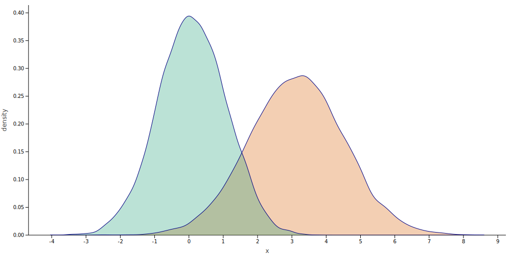
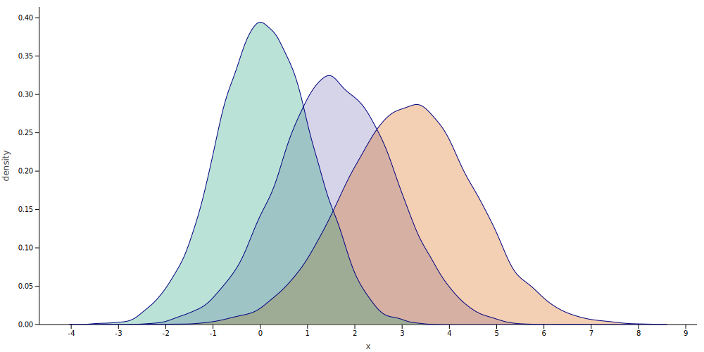
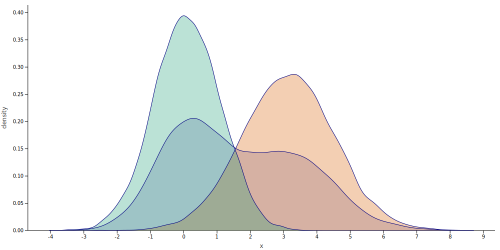
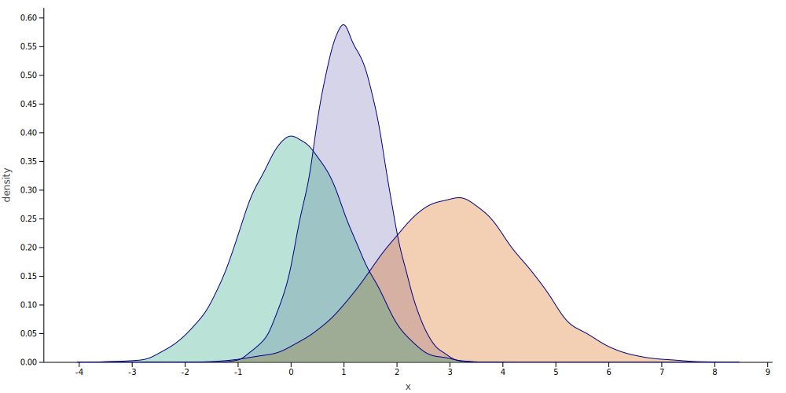

# Markovian

[](http://kotlinlang.org)
[](https://jitpack.io/#breandan/markovian)
[](https://github.com/breandan/markovian/actions)

Automatic integration and probabilistic programming in the spirit of [Church](https://web.stanford.edu/~ngoodman/papers/churchUAI08_rev2.pdf) and [Anglican](https://probprog.github.io/anglican/index.html).

## Research Questions

* Is there a way to compile PGMs to [probabilistic circuits](https://web.cs.ucla.edu/~guyvdb/slides/TPMTutorialUAI19.pdf#1)?
* Is there a algebra that unifies [back/belief/expectation/equilibrium]-prop on PGMs/PCs?
* Is there a family of functions which is closed over differentiation and integration?
* Is there a tractable inversion sampling procedure for higher dimensional quantiles?
* Is there a way to perform inference on Bayesian networks [using backprop](https://arxiv.org/pdf/1301.3847.pdf)?
* Is there a [formula](https://en.wikipedia.org/wiki/Propagation_of_uncertainty#Example_formulae) for propagating uncertainty through elementary functions?

## Summary

The way we teach probability in school is too abstract. First we learn about probability distributions. Where did these distributions come from? How did they arise? To gain a better understanding of probabilistic reasoning, we should start from first principles with an application firmly in mind, and build up our intuition through simple programming exercises.

Why does probability exist? Probability exists because we have imperfect information about the world. Whether due to inaccessibility, poor visibility, measurement error or [other sources](https://en.wikipedia.org/wiki/Uncertainty_quantification#Sources_of_uncertainty), our sensing instruments are only capable of gathering a blurry representation of their environment. We are thus permanently stranded in a state of uncertainty about the world around us. Nevertheless, we would like to reconstruct and reason about possible realities to make informed decisions.

Most computers are by contrast, deterministic and fully observable. How could we use a deterministic machine to simulate a stochastic one? We must first have a source of *noise*. This may come from a the outside world through a special input device called a random number generator (RNG), or lacking one, from an artificial or *pseudo*-RNG (PRNG). A good PRNG will be indistinguishable from an RNG to any observer who does not know its internal state, and whose internal state cannot be easily guessed by observing the outputs. Many [suitable](https://en.wikipedia.org/wiki/Rule_30) [candidates](https://en.wikipedia.org/wiki/Linear_congruential_generator) have been proposed.

What is a probability distribution? A probability distribution is a set of elements, accompanied by the relative frequency which they occur. Suppose we have a foreign language which we do not understand. How could we learn it? First, we might read some text and gather various statistics, such as the alphabet size and how many times each symbol occurs. We could summarize this information in a data structure called a *histogram*. There are [many useful algorithms](https://en.wikipedia.org/wiki/Streaming_algorithm) for computing these summaries efficiently, exactly or approximately.

Now, suppose we want to sample from our probabilistic model. To do so, we could take our histogram and for each symbol, compute a running sum up to its histogram index, called a *cumulative distribution function* (CDF). We draw a sample from our PRNG to get a number uniformly between 0 and 1 in increments of 1/|alphabet|, then select the symbol whose CDF is closest to that number and voila! we have obtained a sample.

In order to sample longer sequences, we might want to incorporate some context, such as pairs of adjacent characters. To do so, we could build a two-dimensional histogram, sample the first symbol from the "marginal" distribution P(T₁=t₁), and the second from the "conditional" distribution P(T₂=t₂|T₁=t₁), the probability of the second character being t₂ given the preceding character was t₁. This data structure is called a Markov or transition matrix.

P(T₁=t₁,T₂=t₂) = P(T₂=t₂|T₁=t₁)P(T₁=t₁)
```
String: abcbbbbccba…
        1   2   3   4   5   6   7   8   9   10  …
Window: ab, bc, cb, bb, bb, bb, bc, cc, cb, ba, …
Counts: 1 , 2 , 2 , 3 , 3 , 3 , 2 , 1 , 2 , 1 , …
Transition matrix at index=10:
   a  b  c …
 ┌─────────
a│ 0  1  0
b│ 1  3  2
c│ 0  1  1
⋮          / 10
```

More generally, we might have longer windows containing triples or n-tuples of contiguous symbols. To represent longer contexts, we could record their probabilities into a multidimensional array or *transition tensor*, representing the probability of a subsequence t₁t₂...tₙ. This tensor is a probability distribution whose conditionals "slice" or disintegrate the tensor along a dimension, producing an n-1 dimensional hyperplane, the conditional probability of observing a given symbol in a given slot:

P(T₁=t₁,T₂=t₂,…,Tₙ=tₙ) = P(Tₙ=tₙ|Tₙ₋₁=tₙ₋₁, Tₙ₋₂=tₙ₋₂, …,T₁=t₁),

where the tensor rank n is given by the context length, T₁...ₙ are random variables and t₁...ₙ are their concrete instantiations. This tensor is a hypercube with shape |alphabet|ⁿ - Each entry identifies a unique subsequence of n symbols, and the probability of observing them in the same context. Note the exponential state space of this model - as n grows larger, this will quickly require a very large amount of space to represent.

The first improvement we could make is to sparsify the tensor, i.e., only record its nonzero entries in some sort of list-based data structure, or sparse dictionary. Suppose in the previous example where n=2, we only stored nonzero entries as a list of pairs of bigrams to their frequency. By doing so, we could reduce the space consumption by 1/3. We could further reduce the space by only storing duplicate frequencies once. This would improve the space consumption by a small factor for multimodal distributions.

```
  Matrix               Sparse List           Bidirectional Map 
  
   a  b  c …                                                   
 ┌─────────                                  (ab,ba,cc) <-> 1   
a│ 0  1  0       [(ab,1),                       (bc,cb) <-> 2   
b│ 1  3  2        (ba,1),(bb,3),(bc,2)             (bb) <-> 3   
c│ 0  2  1               (cb,2),(cc,1)]            else  -> 0   

```

However, we can do even better! Since the prefixes `*b` and `*c` occur more than once, we could store the transition counts as a prefix tree of pairs, whose first entry records the prefix and second records its frequency. Like before, we could compress this into a DAG to deduplicate leaves with equal-frequency. This might be depicted as follows:

```
          Prefix Tree                         Prefix DAG
             (*,10)                              (*,10)
  ┌────────────┼───────────────┐          ┌────────┼────────────┐
(a,1)        (b,6)           (c,3)        a──┐  6──b   ┌────────c
  │      ┌─────┼─────┐      ┌──┴──┐       │  │  ┌──┼───│──┐   ┌─┴─┐  
(b,1)  (a,1) (b,3) (c,2)  (b,2) (c,1)     b  │  a  b   │  c   b   c   
                                          │  ├──│──│───│──│───│───┘
                                          └──┼──┘  └─┬─┘  └─┬─┘  
                                             1       3      2  
```

Space complexity, however important, is only part of the picture. Often the limiting factor in many data structures is the [maximum speedup of parallelization](https://en.wikipedia.org/wiki/Amdahl%27s_law). While concurrent tries and dictionaries are available, they are nontrivial to implement and have suboptimal scaling properties. A much more trivially scalable approach would be to recursively decompose the data into many disjoint subsets, summarize each one, and recombine the summaries. By designing the summary carefully, this process can be made [embarrassingly parallel](https://en.wikipedia.org/wiki/Embarrassingly_parallel).

Mathematically, the structure we are looking for is something called a *monoid*. If the summary of interest can be computed in any order it is called a *commutative monoid*. Many summaries naturally exhibit this property: sum, min, max, top-k and various probability distributions. Summaries which can be decomposed and recombined in this fashion are embarrassingly parallelizable.

```
                             abcbbbbccba ────────────────────────────────────────────┐
              ┌───────────────────┴───────────────┐                                  │
            abcbbb                              bbccba                               │
            (*,5)              +                (*,5)              =               (*,10)                  
  ┌───────────┼───────────┐               ┌───────┴────────┐            ┌────────────┼───────────────┐     
(a,1)       (b,3)       (c,1)  +        (b,3)            (c,2)     =  (a,1)        (b,6)           (c,3)   
  │        ┌──┴──┐        │         ┌─────┼─────┐       ┌──┴──┐         │      ┌─────┼─────┐      ┌──┴──┐  
(b,1)    (b,2) (c,1)    (b,1)  +  (a,1) (b,1) (c,1)   (b,1) (c,1)  =  (b,1)  (a,1) (b,3) (c,2)  (b,2) (c,1)
```

So far, we have considered exact methods. What if we didn't care about estimating the exact transition probability, but only approximating it. How could we achieve that? Perhaps by using a probabilistic data structure, we could reduce the complexity even further.

One approach would be to use an approximate counting algorithm, or [sketch-based summary](https://www.sketchingbigdata.org/). Sketches are probabilistic datastructures for approximately computing some statistic efficiently. Without going into the details, sketching algorithms are designed to smoothly trade off error-bounds for space-efficiency and can be used to compute a summary statistic over a very large number of items. Even with a very low error tolerance, we can often obtain dramatic reduction in space complexity.

What about sample complexity? In many cases, we are not constrained by space or time, but samples. In many high-dimensional settings, even if we had an optimally-efficient sparse encoding, obtaining a faithful approximation to the true distribution would require more data than we could plausibly obtain. How could we do better in terms of sample efficiency? We need two things: (1) inductive priors and (2) learnable parameters. This is where algebraic structure, like groups, rings and their cousins come in handy.

If we squint a little, neural networks are a bit like a mergable summaries which deconstruct their inputs and recombine them in specific ways. For images, we have the special Euclidean group, SE(2). There are many other groups which are interesting to consider in various domains. By constructing our models with these invariants, we can recover latent structure with far, far fewer samples than would be required by a naive encoding scheme. For our purposes, we are particularly interested in semiring algebras, a specific kind of algebra that may be employed to compute many useful properties about graphs such as their longest, shortest and widest paths.

TODO.
<!--There is a model, called a Hidden Markov Model, which allows us to model the observable states without requiring as much space or computation.-->

## Example

Suppose we have two Gaussian distributions with known parameters and want to combine them somehow:



How could we combine them to form a new distribution? We could simply average their densities:



But this might not be a valid operation depending on the units. We could "mix" them by flipping a coin:



But the mean of the mixture might not give the mean of the two datasets. Or we could multiply the PDFs:



Two Gaussian distributions, when multiplied together form another Gaussian! This is a very nice property.

Now we do not need to sample from the parents, but can discard them and sample directly from the child!

## Combinatorial Properties

* [Stable distributions](https://en.wikipedia.org/wiki/Stable_distribution) are closed under convolution and linear combination of their random variables.
* A distribution is called [infinitely divisible](https://en.wikipedia.org/wiki/Infinite_divisibility_(probability)) if it can be expressed as the sum of an arbitrary number of IID RVs.
* Gaussian distributions form a [monoid](https://izbicki.me/blog/gausian-distributions-are-monoids).

We can use these algebraic properties to significantly simplify certain mixture distributions.

See [notebook](notebooks/combinator_exploration.ipynb) for further implementation details.

# References

## Symbolic Methods

* [miniKanren as a Tool for Symbolic Computation in Python](https://arxiv.org/pdf/2005.11644.pdf), Willard (2020)
* [Symbolic Exact Inference for Discrete Probabilistic Programs](https://arxiv.org/pdf/1904.02079.pdf), Holtzen et al. (2019)
* [APPL: A Probability Programming Language](https://www.tandfonline.com/doi/pdf/10.1198/000313001750358509), Glen et al. (2012)
* [Symbolic Statistics with SymPy](http://people.cs.uchicago.edu/~mrocklin/tempspace/sympystats.pdf), Rocklin (2010)
* [PSI: Exact Symbolic Inference for Probabilistic Programs](https://files.sri.inf.ethz.ch/website/papers/psi-solver.pdf), Gehr et al. (2016)
* [λPSI: Exact Inference for Higher-Order Probabilistic Programs](https://files.sri.inf.ethz.ch/website/papers/pldi20-lpsi.pdf), Gehr et al. (2020)
* [Simplifying Probabilistic Programs Using Computer Algebra](http://homes.sice.indiana.edu/ccshan/rational/simplify.pdf), Carette and Shan (2016)
* [Symbolic Maximum Likelihood Estimation with Mathematica](https://rss.onlinelibrary.wiley.com/doi/pdf/10.1111/1467-9884.00233), Rose and Smith (2001)
* [A New Method for Efficient Symbolic Propagation in Discrete Bayesian Networks](https://doi.org/10.1002/(SICI)1097-0037(199608)28:1%3C31::AID-NET5%3E3.0.CO;2-E), Castillo and Gutierrez (1996)
* [Theano: A Python framework for fast computation of mathematical expressions](https://arxiv.org/pdf/1605.02688.pdf#section*.12), Al-Rfou et al. (2016)

## Closure

* [A Class of Probability Distributions that is Closed with Respect to Addition as Well as Multiplication of Independent Random Variables](https://link.springer.com/content/pdf/10.1007/s10959-013-0523-y.pdf), Bondesson (2015)
* [The Harmonic Logarithms and the Binomial Formula](https://core.ac.uk/download/pdf/82415331.pdf), Roman (1993)
* [A New Distribution on the Simplex with Auto-Encoding Applications](https://papers.nips.cc/paper/9520-a-new-distribution-on-the-simplex-with-auto-encoding-applications.pdf), Stirn et al. (2019)
* [Closed Form Integration of Artificial Neural Networks](https://escholarship.org/content/qt0wz7n7nm/qt0wz7n7nm.pdf#page=5), Gottschling (1999)
* [Families of infinitely divisible distributions closed under mixing and convolution](https://projecteuclid.org/download/pdf_1/euclid.aoms/1177692717), Keilson & Steutel (1972)

## Algebraic Methods

* [Semiring Programming: A Declarative Framework for Generalized Sum Product Problems](https://arxiv.org/pdf/1609.06954.pdf), Belle and De Raedt (2020)
* [Algebraic Model Counting](https://arxiv.org/pdf/1211.4475.pdf), Kimmig et al. (2012)
* [The Generalized Distributive Law](https://authors.library.caltech.edu/1541/1/AJIieeetit00.pdf), Aji and McEliece (2000)
* [A Logical Approach for Factoring Belief Networks](http://reasoning.cs.ucla.edu/fetch.php?id=24&type=pdf), Darwiche (2002)
* [Algebra of inference in graphical models revisited](https://www.researchgate.net/profile/Russ_Greiner/publication/266262013_Algebra_of_inference_in_graphical_models_revisited/links/543bb0350cf204cab1db12fa/Algebra-of-inference-in-graphical-models-revisited.pdf), Ravanbakhsh and Greiner (2014)
* [Boolean Matrix Factorization and Noisy Completion via Message Passing](http://proceedings.mlr.press/v48/ravanbakhsha16-supp.pdf), Ravanbakhsh et al. (2016)
* [Message Passing and Combinatorial Optimization](https://arxiv.org/pdf/1508.05013.pdf), Ravanbakhsh (2015)
* [Bayesian Boolean Matrix Factorisation](https://arxiv.org/pdf/1702.06166.pdf), Rukat et al. (2017)
* [Methods and Applications of (max,+) Linear Algebra](https://hal.inria.fr/inria-00073603/document), Gaubert (2006)
* [A New Algebra for the Treatment of Markov Models](http://asrl.utias.utoronto.ca/~tdb/bib/barfoot_tr03a.pdf), Barfoot and D'Eleuterio (2003)
* [Affine Algebraic Decision Diagrams and their Application to Structured Probabilistic Inference](http://users.cecs.anu.edu.au/~ssanner/Papers/aadd.pdf), Sanner and McAllester (2005)
* [An algebraic model for the propagation of errors in matrix calculus](https://arxiv.org/pdf/1907.12948.pdf), Tran (2019)
* [Expectation propagation for t-Exponential family using q-algebra](https://proceedings.neurips.cc/paper/2017/file/17fafe5f6ce2f1904eb09d2e80a4cbf6-Paper.pdf), Futami et al. (2017)

## Uncertainty Propagation

* [A computational system for uncertainty propagation of measurement results](https://doi.org/10.1016/j.measurement.2009.01.011), Mari (2009)
* [Notes on the Use of Propagation of Error Formulas](https://nvlpubs.nist.gov/nistpubs/jres/70C/jresv70Cn4p263_A1b.pdf), Ku (1966)
* [Calculating measurement uncertainty using automatic differentiation](https://doi.org/10.1088/0957-0233/13/4/301), Hall (2001)
* [Uncertainty of Measurement: A Review of the Rules for Calculating Uncertainty Components through Functional Relationships](https://www.ncbi.nlm.nih.gov/pmc/articles/PMC3387884/pdf/cbr_33_2_49.pdf#page=10), Farrance and Frenkel (2012)
* [Propagating Uncertainty in Instrumentation Systems](https://doi.org/10.1109/TIM.2005.859142), Hall (2005)
* [Object-oriented software for evaluating measurement uncertainty](https://doi.org/10.1088%2F0957-0233%2F24%2F5%2F055004), Hall (2013)
* [Propagation of uncertainty: Expressions of second and third order uncertainty with third and fourth moments](https://doi.org/10.1016/j.measurement.2007.07.004), Mekid and Vaja (2008)
* [Propagation of errors for matrix inversion](https://doi.org/10.1016/S0168-9002(00)00323-5), Lefebvre (2000)
* [Error propagation in Runge-Kutta methods](https://doi.org/10.1016/S0168-9274(96)00040-2), Spijker (1996)
* [Error propagation and algorithms](https://arxiv.org/pdf/1805.11813.pdf#subsection.2.1), Clift and Murfet (2019)
* [Propagating Covariance in Computer Vision](http://www.haralick.org/conferences/Propagating_Covariance.pdf), Haralick (1994)
* [Propagation of Probabilities, Means, and Variances in Mixed Graphical Association Models](https://doi.org/10.1080/01621459.1992.10476265), Lauritzen (1992)
* [Uncertainty Propagation in Data Processing Systems](https://doi.org/10.1145/3267809.3267833), Manousakis et al. (2018)

### Tutorials

* [Propagation of Uncertainty through Mathematical Operations](http://web.mit.edu/fluids-modules/www/exper_techniques/2.Propagation_of_Uncertaint.pdf)
* [A Summary of Error Propagation](http://ipl.physics.harvard.edu/wp-uploads/2013/03/PS3_Error_Propagation_sp13.pdf)
* [An Introduction To Error Propagation](https://infoscience.epfl.ch/record/97374/files/TR-98-01R3.pdf), Arras (1998)

## Fast Sampling/Inference

* [Efficient Parallel Random Sampling – Vectorized,
  Cache-Efficient, and Online](https://arxiv.org/pdf/1610.05141.pdf), Sanders et al. (2019)
* [Augur: Data-Parallel Probabilistic Modeling](https://papers.nips.cc/paper/2014/file/cf9a242b70f45317ffd281241fa66502-Paper.pdf), Tristan et al. (2014)
* [A Differential Approach to Inference in Bayesian Networks](https://arxiv.org/pdf/1301.3847.pdf), Darwiche (2000)
* [Scaling Exact Inference for Discrete Probabilistic Programs](https://arxiv.org/pdf/2005.09089.pdf), Holtzen et al. (2020)
* [Parallel Weighted Model Counting with Tensor Networks](https://arxiv.org/pdf/2006.15512.pdf), Dudek and Vardi (2020)
* [Faster Algorithms for Max-Product Message-Passing](https://cseweb.ucsd.edu/~jmcauley/pdfs/jmlr11.pdf), McAuley and Caetano (2011)
* [Fast inverse transform sampling in one and two dimensions](https://arxiv.org/pdf/1307.1223.pdf), Olver and Townsend (2013)
* [Fast and accurate parallel quantile computation](https://discovery.ucl.ac.uk/id/eprint/1482128/1/Luu_thesis.pdf#page=12), Luu (2016)
* [Fast Random Integer Generation in an Interval](https://arxiv.org/pdf/1805.10941.pdf), Lemire (2018)
* [Fast Evaluation of Transcendental Functions](https://www.researchgate.net/profile/Ekaterina_Karatsuba/publication/246166981_Fast_evaluation_of_transcendental_functions/links/0deec528ab5b45f8bc000000/Fast-evaluation-of-transcendental-functions.pdf), Karatsuba (1991)

## Tensor Methods

* [Tensor Train Spectral Method for Learning of Hidden Markov Models](https://www.researchgate.net/profile/Ivan-Oseledets/publication/326980338_Tensor_Train_Spectral_Method_for_Learning_of_Hidden_Markov_Models_HMM/links/5bbb03c592851c7fde33b5b5/Tensor-Train-Spectral-Method-for-Learning-of-Hidden-Markov-Models-HMM.pdf), Kuznetsov & Oseledets (2019)
* [Tensor Balancing on Statistical Manifold](https://arxiv.org/pdf/1702.08142.pdf), Sugiyama et al. (2018)
* [Dynamic Multidimensional Histograms](http://citeseerx.ist.psu.edu/viewdoc/download?doi=10.1.1.92.1201&rep=rep1&type=pdf), Thaper et al. (2002)

## Online Estimation

* [Space-Efficient Online Computation of Quantile Summaries](http://infolab.stanford.edu/~datar/courses/cs361a/papers/quantiles.pdf), Greenwald and Khanna (2001)
* [Frugal Streaming for Estimating Quantiles: One (or two) memory suffices](https://arxiv.org/pdf/1407.1121.pdf), Ma et al. (2014)
* [Smooth estimates of multiple quantiles in dynamically varying data streams](https://doi.org/10.1007/s10044-019-00794-3), Hammer and Yazidi (2019)

## Sketching

* [Mergeable summaries](https://www.cs.utah.edu/~jeffp/papers/merge-summ.pdf), Agarwal et al. (2012)
* [Optimal Quantile Approximation in Streams](https://arxiv.org/pdf/1603.05346.pdf), Karnin et al. (2019)
* [Fast Concurrent Data Sketches](https://dl.acm.org/doi/pdf/10.1145/3332466.3374512), Rinberg et al. (2020)
* [Data-Independent Space Partitionings for Summaries](http://www.compsciscience.org/shekelyan/papers/preprint_pods21.pdf), Cormode et al. (2021)
* [Small Summaries for Big Data](http://dimacs.rutgers.edu/~graham/ssbd.html), Cormode & Yi (2021)

## Probabilistic Circuits (e.g. ACs, SPNs, PSDDs, et al.)

* [On the Relationship between Sum-Product Networks and Bayesian Networks](http://proceedings.mlr.press/v37/zhaoc15.pdf), Zhao et al. (2015) [[supplementary material](https://hanzhaoml.github.io/papers/ICML2015/SPN-supplementary.pdf)]
* [Probabilistic Circuits: A Unifying Framework for Tractable Probabilistic Models](http://starai.cs.ucla.edu/papers/ProbCirc20.pdf), Choi et al. (2020)
* [Probabilistic Circuits: Representations, Inference, Learning and Theory](https://web.cs.ucla.edu/~guyvdb/slides/TPMTutorialUAI19.pdf), Vergari et al. (2020) [[ECML-PKDD talk](https://www.youtube.com/watch?v=2RAG5-L9R70)]
* [Sum-product networks: A survey](https://arxiv.org/pdf/2004.01167.pdf), París et al. (2020)
* [Sum-Product Networks: A New Deep Architecture](http://spn.cs.washington.edu/spn/poon11.pdf), Poon and Domingos (2012) [[source code](http://spn.cs.washington.edu/spn/downloadspn.php), [user guide](http://spn.cs.washington.edu/spn/spn-user-guide.pdf)]
* [Learning the Structure of Sum-Product Networks](https://homes.cs.washington.edu/~pedrod/papers/mlc13.pdf), Gens and Domingos (2013) [[source code](http://spn.cs.washington.edu/learnspn/)]
* [Tractable Operations for Arithmetic Circuits of Probabilistic Models](https://papers.nips.cc/paper/6363-tractable-operations-for-arithmetic-circuits-of-probabilistic-models.pdf), Shen, Choi and Darwiche (2016)
* [On Relaxing Determinism in Arithmetic Circuits](https://arxiv.org/pdf/1708.06846.pdf), Choi and Darwiche (2017)
* [Approximate Inference by Compilation to Arithmetic Circuits](http://ai.cs.washington.edu/www/media/papers/nips10b.pdf), Lowd and Domingos (2010)
* [The Sum-Product Theorem: A Foundation for Learning Tractable Models](https://homes.cs.washington.edu/~pedrod/papers/mlc16.pdf), Friesen (2016)
* [The Sum-Product Theorem and its Applications](https://digital.lib.washington.edu/researchworks/bitstream/handle/1773/40872/Friesen_washington_0250E_18101.pdf), Friesen (2016)
* [Learning and Inference in Tractable Probabilistic Knowledge Bases](https://homes.cs.washington.edu/~pedrod/papers/uai15.pdf), Niepert and Domingos (2015)
* [Combining Sum-Product Network and Noisy-Or Model for Ontology Matching](http://disi.unitn.it/~pavel/om2015/papers/om2015_TSpaper1.pdf), Li (2015)
* [On the Relationship between Sum-Product Networks and Bayesian Networks](https://arxiv.org/pdf/1501.01239.pdf), Zhao et al. (2015) [[slides](https://pdfs.semanticscholar.org/e6ae/d5eb4d3330ed0024063dc64226517bc41fb7.pdf)]
* [Two Reformulation Approaches to Maximum-A-Posteriori Inference in Sum-Product Networks](https://www.alessandroantonucci.me/papers/maua2020a.pdf), Maua et al. (2020)
* [Sum-Product Graphical Models](https://ipa.iwr.uni-heidelberg.de/dokuwiki/Papers/Desana2020aa.pdf), Desana and Schnörr (2020)

## Probabilistic Programming

* [Foundations of Probabilistic Programming](https://doi.org/10.1017/9781108770750)
* [An Introduction to Probabilistic Programming](https://arxiv.org/pdf/1809.10756.pdf), van de Meent et al. (2018)
* [Exact Bayesian Inference by Symbolic Disintegration](https://homes.sice.indiana.edu/ccshan/rational/disintegrator.pdf), Shan and Ramsey (2017)

## Software

### Sketching libraries

* [Apache DataSketches: A library of stochastic streaming algorithms](https://datasketches.apache.org/), Rhodes et al. (2021) [[source code](https://github.com/apache/datasketches-java)]
* [DDSketch: A Fast and Fully-Mergeable Quantile Sketch](https://arxiv.org/pdf/1908.10693.pdf), Masson et al. (2019) [[source code](https://github.com/DataDog/sketches-java)]
* [Summingbird: a framework for integrating batch and online MapReduce computations](https://dl.acm.org/doi/abs/10.14778/2733004.2733016), Boykin et al. (2014) [[source code](https://github.com/twitter/summingbird)]
* [Computing Extremely Accurate Quantiles Using t-Digests](https://github.com/tdunning/t-digest/blob/main/docs/t-digest-paper/histo.pdf), Dunning and Ertl (2019) [[source code](https://github.com/tdunning/t-digest)]

### Probabilistic programming libraries

* [SPFlow: A library for deep probabilistic learning using SPNs](https://arxiv.org/pdf/1901.03704.pdf), Molina et al. (2019) [[source code](https://github.com/SPFlow/SPFlow)]
* [Dimple: Java and Matlab libraries for probabilistic inference](https://s3.amazonaws.com/files.dimple.probprog.org/DimpleUserManual_v0.07_Java_API.pdf#section.4), Barber et al. (2016) [[source code](https://github.com/analog-garage/dimple/tree/master/solvers/java/src/main/java/com/analog/lyric/dimple/solvers/sumproduct)]
* [Chimple: a Probabilistic Programming Java API](https://s3.amazonaws.com/files.dimple.probprog.org/Chimple_User_Documentation.pdf#%5B%7B%22num%22%3A6%2C%22gen%22%3A0%7D%2C%7B%22name%22%3A%22XYZ%22%7D%2C93.6%2C344.7%2C0%5D), Hershey et al. (2016) [[source code](https://github.com/analog-garage/chimple/tree/master/java/src/main/java/com/analog/lyric/chimple)]
* [CREMA: A Java Library for Credal Network Inference](https://pgm2020.cs.aau.dk/wp-content/uploads/2020/09/huber20.pdf), Huber et al. (2020) [[source code](https://github.com/IDSIA/crema)]
* [CREDICI: A Java Library for Causal Inference by Credal Networks](https://pgm2020.cs.aau.dk/wp-content/uploads/2020/09/cabanas20a.pdf), Cabañas et al. (2020) [[source code](https://github.com/IDSIA/credici)]
* [JavaBayes: Bayesian networks in Java](https://people.montefiore.uliege.be/lwh/javabayes/javabayes-manual-0.346.pdf), Cozman (2001) [[source code](https://github.com/joeschweitzer/javabayes)]
* [Theano-PyMC](https://pymc-devs.medium.com/the-future-of-pymc3-or-theano-is-dead-long-live-theano-d8005f8a0e9b), Willard (2020) [[source code](https://github.com/pymc-devs/Theano-PyMC)]
* [MonteCarloMeasurements.jl: Nonlinear Propagation of Arbitrary Multivariate Distributions by means of Method Overloading](https://arxiv.org/pdf/2001.07625.pdf), Carlson (2020) [[source code](https://github.com/baggepinnen/MonteCarloMeasurements.jl)]

### NLP libraries

* [Part-of-Speech Tagging in Kotlin](https://www.mariakhalusova.com/posts/2021-03-08-pos-tagging-with-hmm/), Khalusova (2021) [[source code](https://github.com/MKhalusova/pos-tagging/)]